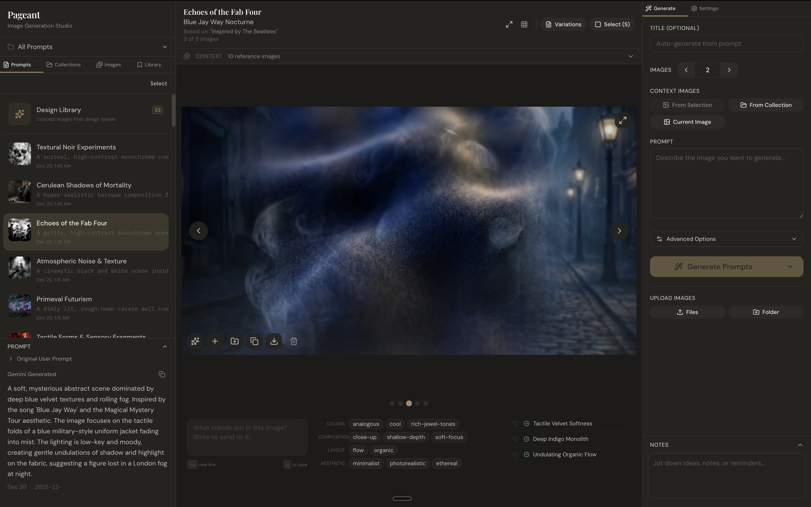

# Pageant

A place to vibe-create with nano-banana pro.

**What makes it interesting:**

1. **Batch generation** — generate many variations at once, not one image at a time
2. **Feedback-first UI** — refine prompts before generation, annotate images, star favorites, build collections
3. **Design token extraction** — pull out design dimensions from images you like (colors, composition, mood, aesthetic) and remix them into new generations




## Quick Start

```bash
# Install Bun and uv (if you haven't)
curl -fsSL https://bun.sh/install | bash
curl -LsSf https://astral.sh/uv/install.sh | sh

# Install dependencies + seed data
make install

# Get your Gemini API key from Google AI Studio
# https://aistudio.google.com/app/apikey

# Save the key
mkdir -p ~/.gemini
echo "your-key-here" > ~/.gemini/apikey.txt

# Run
make dev
```

Open **http://localhost:5173**.

> **Tip:** `make install` includes sample design tokens and concept images so you can explore the UI right away.

## Workflow

### Two-Phase Generation

1. **Generate Prompts** — enter a base idea, get AI-generated variations with annotation suggestions
2. **Refine** — edit variations, tweak annotations, pick which to generate
3. **Batch Generate** — generate all selected prompts

Iterate on prompts before burning API calls on images.

### Design Tokens

Extract reusable design concepts from images that work.

- Select images → Extract Token → Choose a design dimension
- Tokens capture: color palette, composition style, mood, aesthetic
- Apply tokens to future generations

## Features

- **View Modes**: Single and Grid
- **Collections**: Group images
- **Context Images**: Use existing images as style references
- **Templates**: Save prompt structures
- **Favorites**: Star generations
- **Batch Operations**: Bulk actions on selections
- **Keyboard Shortcuts**: `1`/`2` views, `←`/`→` navigate, `F` favorite
- **Sessions & Notes**: Track process

## Tech Stack

**Frontend**: React 19, TypeScript, Vite 7, Bun, Tailwind CSS v4, Zustand, Framer Motion

**Backend**: FastAPI, Google Gemini API, Pydantic

## Development

```bash
make dev          # Start frontend + backend
bun run test      # Run tests
bun run lint      # Lint
bun run build     # Type check + build
```

## API Key

Checked in order:
1. `~/.gemini/apikey.txt`
2. `GEMINI_API_KEY` env var
3. `GEMINI_API_KEY_PATH` pointing to key file

## License

MIT
