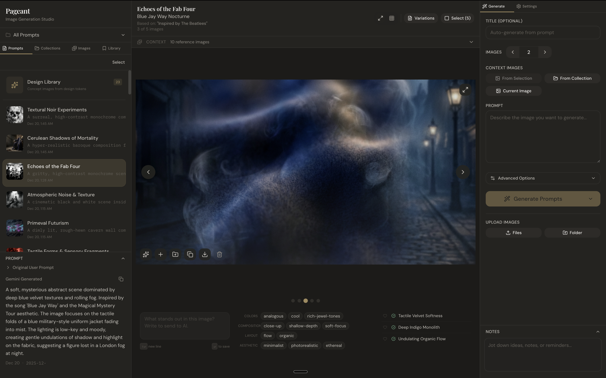

# Pageant

My interface for vibe-creating with nano-banana pro. It's built around two ideas:

### 1. Context Engineering for Image Models

For image models, what images we attach, what we say about them, what preferences we express strongly influences what we get back. Pageant implements three features to make context engineering less of a chore and even fun:

- **Auto-selected reference images.** We can add many candidate images into our context, and Gemini picks which images to attach to each prompt variation based on what we're trying to achieve.
- **Annotations that travel with images.** Annotate an image, like specific design axes (color palette, composition, mood), and those preferences get sent as context whenever the image is attached.
- **Design Tokens.** Extract a core visual concept from an image—isolate the thing that makes it work—and apply it to future generations.



### 2. Batch Experimentation

I believe that great art comes from tinkering and experimentation. Pageant is built for making this easy:

- We can enter one prompt idea + many reference images (along with their annotation metadata) → Gemini generates _n_ variations, each with its own reference images and annotations
- The workflow is fully asynchronous. We can fire off many prompt sets in parallel.


## Quick Start

```bash
# Install Bun and uv (if you haven't)
curl -fsSL https://bun.sh/install | bash
curl -LsSf https://astral.sh/uv/install.sh | sh

# Install dependencies + seed data
make install

# Set up your Gemini API key (see "Getting Your API Key" below)
mkdir -p ~/.gemini
echo "your-api-key" > ~/.gemini/apikey.txt

# Run
make dev
```

Open **http://localhost:5180**.

> **Tip:** `make install` includes sample design tokens and concept images so you can explore the UI right away.

## Docker

Run Pageant with Docker for a simpler setup. Requires [Docker Desktop](https://www.docker.com/products/docker-desktop/) (or an alternative like Colima).

```bash
# Build the image
docker build -t pageant .

# Run with your API key
docker run -p 8080:8080 \
  -v $(pwd)/output:/app/generated_images \
  -v ~/.gemini/apikey.txt:/run/secrets/gemini_api_key:ro \
  pageant
```

Or use docker-compose:

```bash
# Copy and configure .env
cp .env.example .env

# Start
docker-compose up
```

Open **http://localhost:8080**.

Generated images are saved to `./output` on your host machine for easy access. Use Settings > "Open Images Folder" to open this folder directly.

## Other Features

- **View Modes**: Single and Grid (`1`/`2` keys)
- **Collections**: Group images into collections
- **Templates**: Save reusable prompt structures
- **Favorites**: Star images (`F` key)
- **Keyboard navigation**: `←`/`→` to move through images

## Tech Stack

**Frontend**: React 19, TypeScript, Vite 7, Bun, Tailwind CSS v4, Zustand, Framer Motion

**Backend**: FastAPI, Google Gemini API, Pydantic

## Development

```bash
make dev          # Start frontend + backend
bun run test      # Run tests
bun run lint      # Lint
bun run build     # Type check + build
```

## Getting Your API Key

([Official docs](https://ai.google.dev/gemini-api/docs/api-key))

1. Go to [Google AI Studio](https://aistudio.google.com/)
2. Sign in with your Google account
3. Accept the Terms of Service (first time only)
4. Click **Get API key** in the left sidebar (key icon)
5. Copy your key—for new users, a default key is already created. Click the truncated key value (looks like `...abc123`) to copy it.
6. Save it:
   ```bash
   mkdir -p ~/.gemini
   echo "your-copied-key" > ~/.gemini/apikey.txt
   ```

Pageant checks for the key in this order:
1. `~/.gemini/apikey.txt`
2. `GEMINI_API_KEY` env var
3. `GEMINI_API_KEY_PATH` pointing to key file

## License

MIT
